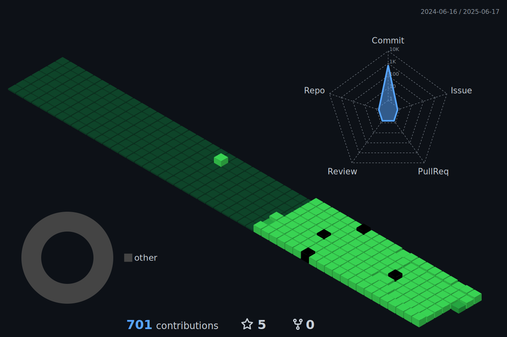

<!-- ### Hello, my name is Eduardo Busolin -->


<p align="center">
  </a>
</p>

<p align="center">
    <a href="https://github.com/oBuzolin?tab=repositories">
      
    </a>
    <a href="https://github.com/oBuzolin?tab=followers">
      
    </a>
    </a>
</p>

<div align="center">
   
  
</div>

<!-- <p align="center">
    
</p> -->

##

```yaml
name: Eduardo Busolin da Silva
located_in: Limeira, São Paulo (Brazil)
job: E-Commerce Manager
education:
  [
    "Computer Science": "UNIP",
    "System Developing": "Colégio Técnico de Limeira (COTIL)",
  ]
past_experiences:
  - ["E-Commerce Assistant", "RR Parafusos Limeira", "Brazil", "2023/Oct-2024"]
  - [
      "E-Commerce Manger",
      "Limerfix Suprimentos Indústriais",
      "Brazil",
      "Nov-2024/the moment",
    ]

fields_of_interests:
  [
    "Mobile App Development",
    "Write Once, Run Everywhere ",
    "Network Security",
    "Cryptography",
    "Blockchain",
    "Quantum Computing",
    "Cyber-Security",
    "Cyber Risk Management",
    "Cloud Security",
    "Software as a Service",
  ]
currently_learning:
  [
    "Kotlin",
    "Android App Development",
    "Revisiting Java main concepts",
    "Operating Systems",
    "Cybersecurity Concepts",
    "Software Architectures",
    "Data Analysis",
    "Database Management",
  ]
will_learn: ["Quantum Computing"]
```

<details open>
  <summary><h2>📊 Github Stats and Activity</h2></summary>

  <h3>💻 GitHub Profile Stats</h3>
  <p align="center">
    <a href="https://github.com/oBuzolin">
      <source media="(prefers-color-scheme: light)" srcset="src/images/profile-3d/profile-night-rainbow.svg" width = "98%">
      
    </a>
  </p>

<br>

<a href="https://github.com/oBuzolin"></a>

<!--START_SECTION:activity-->
<!--END_SECTION:activity-->
</details>

<details open> 
  <summary><h2>🛠️ My Favorite Tools</h2></summary>
  <!-- Some badges are from https://github.com/Ileriayo/markdown-badges -->

  <h3>👨‍💻 Programming Languages</h3>

  <p>
      <a href="https://www.java.com/"></a>
      <a href="https://www.javascript.com/"></a>
      <a href="https://kotlinlang.org/docs/home.html"></a>
  </p>

  <h3>🧰 Frameworks</h3>

  <p>
      <a href="https://spring.io/projects/spring-boot"></a>

  <h3>🗄️ Databases</h3>

  <p>
      <a href="https://www.mysql.com/"></a>
      <a href="https://www.postgresql.org/"></a>
      <a href="https://firebase.google.com/"></a>
  </p>

  <h3>💻 Software and Tools</h3>

<p>
    <a href="https://git-scm.com/"></a>
    <a href="https://www.postman.com/"></a>
    <a href="https://developer.android.com/"></a>
    <a href="https://code.visualstudio.com/"></a>
    <a href="https://www.figma.com/"></a>
    <a href="https://trello.com/"></a>
    <a href="https://www.notion.so/"></a>
    <a href="https://discord.com/"></a>
</p>

</details>

<div align="center">
    <br><br><br><br><br><br><p align="centre"><b>count++ </b></p>  
    <p align="center"></p> 
    <br>
  </div>

##

<div>
  <h3 align="center">🌎 Find me around the web</h3>
  <p align="center">
  <a href="https://www.linkedin.com/in/eduardo-busolin-da-silva-3a243226bn/" target="_blank"></a> 
  <a href = "https://mail.google.com/mail/?view=cm&fs=1&to=buzolinedu@outlook.com"></a>
  </p>
</div>
